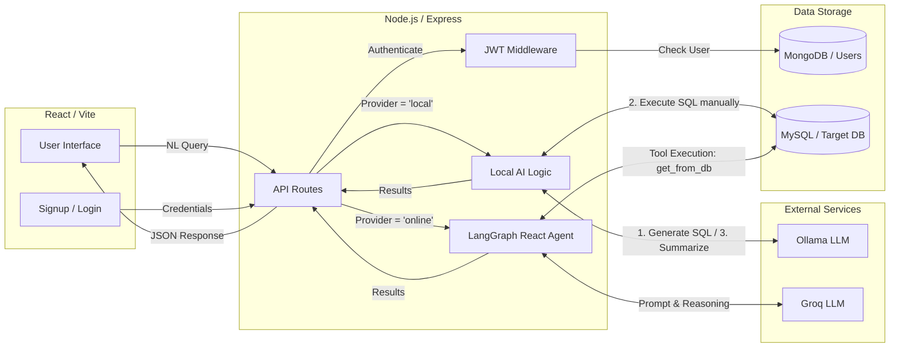
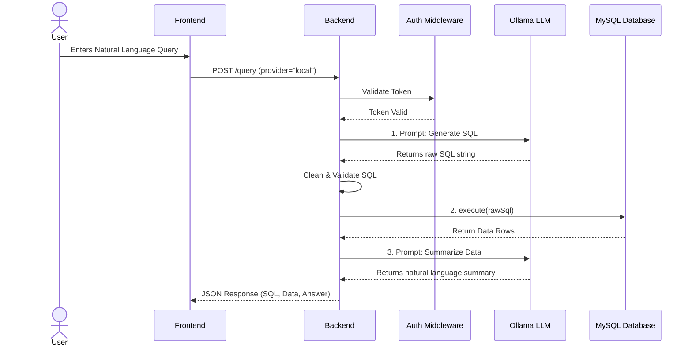
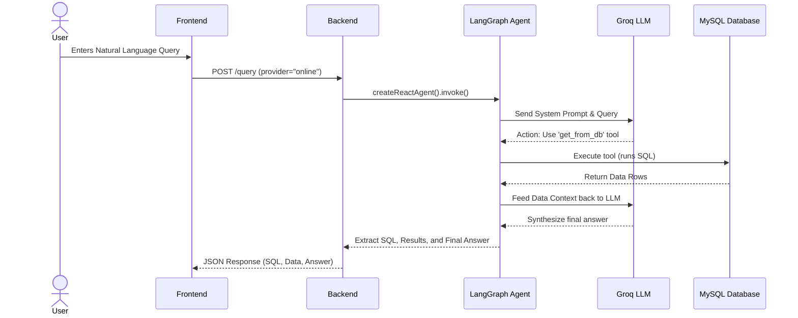
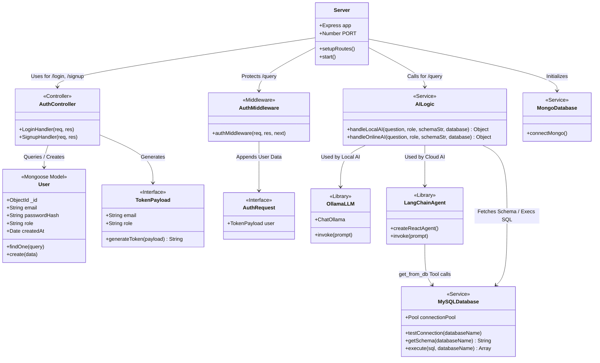

# Natural Language to SQL (NLS2SQL) - Full Stack Application

---

## 🚀 Key Features

*   **AI-Powered SQL Generation**: Converts plain English questions into complex SQL queries using advanced language models (via LangChain, Groq, and Ollama).
*   **Secure Authentication**: Fully implemented JWT-based authentication system with encrypted passwords using `bcryptjs`.
*   **Role-Based Access Control (RBAC)**: Supports `admin` and `user` roles to restrict access to specific features and endpoints.
*   **Modern Frontend**: A beautifully designed React interface using Radix UI components, Framer Motion for animations, and Tailwind CSS for styling.
*   **Robust Backend**: An Express server built with TypeScript, ensuring type safety and maintainability.
*   **Database Integration**: Connects to MongoDB for user management and MySQL for actual database query execution.

---

## 🛠️ Tech Stack

### Frontend
*   **Framework**: React 18 & Vite
*   **Routing**: React Router
*   **Styling**: Tailwind CSS v4, Shadcn UI / Radix UI primitives
*   **Animations**: Framer Motion
*   **Language**: TypeScript

### Backend
*   **Server**: Node.js & Express.js
*   **Language**: TypeScript (running via `tsx`)
*   **Authentication**: JSON Web Tokens (JWT), bcryptjs
*   **AI / LLM Framework**: LangChain/LangGraph (Groq, Ollama integrations)
*   **Databases**: 
    *   MongoDB (Mongoose) for Authentication & Users
    *   MySQL2 for SQL execution

---

## 📁 Project Structure

```text
practiceNLS2SQL/
├── backend/
│   ├── src/
│   │   ├── authentication/ # Auth handlers, User schema, MongoDB connection
│   │   ├── ai.ts           # LangChain and AI model configurations
│   │   └── server.ts       # Express server entry point
│   ├── .env                # Backend environment variables
│   └── package.json        
│
├── frontend/
│   ├── src/
│   │   ├── app/
│   │   │   └── components/ # React components (Signup, Login, ConverterPanel, etc.)
│   │   └── index.html
│   ├── vite.config.ts      # Vite configuration
│   └── package.json        
│
├── README.md               # Main project documentation
└── README_AUTH.md          # Detailed Authentication Architecture
```

---

## ⚙️ Prerequisites

Before you begin, ensure you have the following installed:
*   [Node.js](https://nodejs.org/) (v18 or higher recommended)
*   [MongoDB](https://www.mongodb.com/) (Local instance or MongoDB Atlas)
*   [MySQL](https://www.mysql.com/) (Local instance or remote)
*   `npm` or `pnpm` package manager

---

## 🚦 Getting Started

### 1. Clone the Repository
```bash
git clone https://github.com/your-username/NLS2SQL-Using-Express-Server.git
cd practiceNLS2SQL
```

### 2. Backend Setup
Navigate to the backend directory, install dependencies, and configure your environment variables.

```bash
cd backend
npm install
```

Create a `.env` file in the `backend/` directory:
```env
# Authentication
JWT_SECRET=your_super_secret_jwt_key
MONGO_URI=mongodb://localhost:27017/nls2sql_db

# AI API Keys
GROQ_API_KEY=your_groq_api_key

# Target Database Config
DB_HOST=localhost
DB_USER=root
DB_PASSWORD=your_mysql_password
DB_NAME=your_target_database
```

Start the backend server:
```bash
npm run dev
```
*The server will start (typically on port 3000 or 5000), listening for incoming API requests.*

### 3. Frontend Setup
Open a new terminal, navigate to the frontend directory, and install dependencies.

```bash
cd frontend
npm install
```

Start the frontend development server:
```bash
npm run dev
```
*The application will open in your default browser (typically at http://localhost:5173).*

---

## 🔐 Authentication Architecture

This project features a robust JWT and MongoDB authentication flow. 
For a deep dive into how users are created, how passwords are hashed, and how routes are protected using middleware, please read the dedicated **[Authentication Architecture Documentation (README_AUTH.md)](./README_AUTH.md)**.

---

## 🤝 Contributing

Contributions, issues, and feature requests are welcome! 
1. Fork the Project
2. Create your Feature Branch (`git checkout -b feature/AmazingFeature`)
3. Commit your Changes (`git commit -m 'Add some AmazingFeature'`)
4. Push to the Branch (`git push origin feature/AmazingFeature`)
5. Open a Pull Request

---

## 📝 License

Distributed under the MIT License. See `LICENSE` for more information.

---

## 📊 Diagrams

### Architectural Diagram
This diagram shows the high-level flow of data, explicitly separating the **Local AI (Offline)** sequential approach from the **Cloud AI (Online)** Agent-based approach.



### Sequence Diagram 1: Local / Offline AI Flow
The Local AI relies on a **Sequential Flow** managed directly by the backend controller, without an orchestrating agent.



### Sequence Diagram 2: Cloud / Online AI Flow
The Cloud AI utilizes a **LangGraph React Agent** to dynamically determine when to execute SQL using a provided tool (`get_from_db`).



### Complete System Class Diagram
This represents the core modules, interfaces, and controllers that make up the Express backend.


